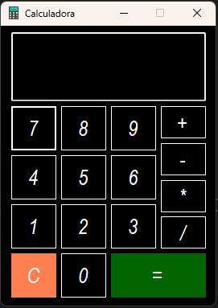

# 🧮 Calculadora em C# com Windows Forms

Este projeto é uma **calculadora básica desenvolvida em C# usando Windows Forms**, com aparência e comportamento semelhantes à calculadora padrão do Windows. A aplicação é simples, eficiente e conta com funcionalidades fundamentais para garantir segurança e facilidade de uso.

## 📸 Captura de Tela

---

## 🛠️ Funcionalidades

- Interface visual semelhante à calculadora do Windows.
- Operações matemáticas básicas: **+**, **-**, **×**, **÷**.
- Utilização do **objeto `sender`** para identificar qual botão foi clicado.
- Método `Compute()` responsável por processar e calcular o resultado.
- Botão **Clear (C)** para reiniciar a calculadora.
- Verificações de segurança:
  - Proibição de **divisão por zero**.
  - Bloqueio de **operadores duplicados** na sequência (ex: `++`, `*/`, etc).

---

## 🧩 Lógica de Funcionamento

### 🎯 Detecção dos Botões com `sender`

Todos os botões numéricos e de operação são tratados por um único evento de clique. Através do **objeto `sender`**, identificamos qual botão foi pressionado e atualizamos a expressão exibida.

🧠 Cálculo com Compute()

Quando o botão “=” é pressionado, a função Compute() é chamada para avaliar a expressão atual. Utilizamos o DataTable().Compute() para realizar o cálculo de forma segura.

🧼 Botão Clear (C)

O botão Clear reseta a tela e limpa toda a expressão armazenada.

🛡️ Validações de Segurança

Divisão por zero: ao tentar dividir por 0, a calculadora exibe uma mensagem de erro e cancela a operação.

Operadores consecutivos: se o último caractere for um operador e o próximo também for, a entrada é ignorada.

📄 Licença

Este projeto está sob a licença MIT. Sinta-se livre para usar, modificar e distribuir.